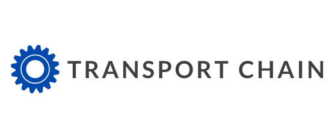
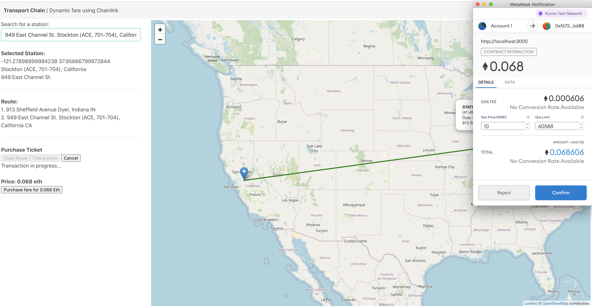

<p align='center'>
    
</p>

## TransportChain

Dynamic pricing for government transport services.

A chainlink model that allows purchase of public transport passes based on volume present at different transport hubs and the number of passes previously purchased.

Used several different blockchain technologies to make this project, going after:

1. Government tech prize
2. Social impact prize.
3. GeoDB (oracle) - used for querying
4. MATIC (deployment) - mumbai testnet contract: 0xDB73769d3132DcDE68D27B91E2dd278BD6Be917a
5. Plasm (deployment) - testnet contract: 0xbEc5b1faDE897D49A10DC02fD405dCa2aC4C752f
6. Moonbeam (deployment) - 0x7fB677AaB295F9B17C12E39FDED8Ee03885C0fF2
7. 88mph (contract) - DInterest contract addable (concept, potentially includable in a future deployment) for pushing funds from fare purchases to interest bearing pools.

Ethereum Kovan network: 0xf672b3d4d31b287D9faF733119F5b1bDbDB9b6B8

## Inspiration

Covid caused a huge drop in public service usage that could be mitigated/reduced by offering the public the ability to pre-purchase futures for public transport on chainlink.

Right now I could go buy a bus pass and it always costs \$2.50.
You don't want to have big chunks of the day or the year where running transport is open. Might as well discount them so you can still fill them up.

They run this at ski resorts because if there's a big event that causes a drop in people they still want to invite attendees. Transport business can get a more stable source of revenue if individuals purchase longer term passes. Customers also win because they know the price isn't going to go way up if the demand goes way up in the future.

## What it does

- Uses chainlink oracles to model/track attendence at different airport and transportation hubs.
- Determines a real-time price for a given transport contract.
- Generates a receipt representing your pass purchase.
- Currently deployed on the Kovan testnet.

<p align='center'>
    <br/>
    Collecting payment for a given route using metamask.
</p>

## How we built it

TransportChain queries an index of Amtrak/train locations across the US allowing the user to create their own custom route for pass purchase.

A smartcontract determines the pricing of the fare based on the user population/trends at the different stations over the past 2 months.

Upon completing the purchase, the user is redirected to a receipt/completion page linking to the transaction alongside the created pass document as a pdf. Currently supports the Kovan network only.

- Remix (contracts and compilation)
- Metamask/web3 (contract interaction)
- Chainlink (base contract)
- GeoDB (API)
- Plasm (deployment)
- Matic (deployment)

Demo: transportchain.netlify.com

## Challenges we ran into

- Integrating the different blockchain technologies in a single chainlink contracts.
- Deploying and configuring the contracts on different provider networks.
- Connecting the FE to the Kovan test network with metamask.

## What's next for Transport Chain

- Support longer term passes
- More historic data to improve the pricing model
- Admin graphs/reporting of purchases made by users

## Screenshots

<!--
### Useful links
- https://blog.chain.link/matic-defi-price-feeds/
- https://docs.plasmnet.io/build/smart-contracts/ethereum-contract-on-dusty-network
- https://docs.avax.network/build/tutorials/smart-contracts/deploy-a-smart-contract-on-avalanche-using-remix-and-metamask
- https://docs.matic.network/docs/develop/getting-started/
- https://betterprogramming.pub/how-to-connect-a-react-app-to-the-blockchain-fa9dbd0bbd69
-->

# Contracts / Truffle

## Requirements

- NPM

## Installation

1. Install truffle

```bash
npm install truffle -g
```

2. Setup repo

```bash
mkdir MyChainlinkProject
cd MyChainlinkProject/
```

3. Unbox

```bash
truffle unbox smartcontractkit/box
```

4. Install dependencies by running:

```bash
npm install

# OR...

yarn install
```

## Test

```bash
npm test
```

## Deploy

For deploying to the kovan network, Truffle will use `truffle-hdwallet-provider` for your mnemonic and an RPC URL. Set your environment variables `$RPC_URL` and `$MNEMONIC` before running:

```bash
npm run migrate:kovan
```

You can also run:

```bash
truffle migrate --network kovan --reset
```

If you want to use truffle commands.

### Local Blockchain

> :warning: Without a Chainlink node deployed locally, requests from smart contracts will not be responded to. We recommend you deploy to the Kovan network

If needed, edit the `truffle-config.js` config file to set the desired network to a different port. It assumes any network is running the RPC port on 8545.

```bash
npm run migrate:dev
```

## Helper Scripts

There are 3 helper scripts provided with this box in the scripts directory:

- `fund-contract.js`
- `request-data.js`
- `read-contract.js`

In addition, for working with Chainlink Price Feeds and ChainlinkVRF there are folders respectively.

They can be used by calling them from `npx truffle exec`, for example:

```bash
npx truffle exec scripts/fund-contract.js --network kovan
```

The CLI will output something similar to the following:

```
Using network 'kovan'.

Funding contract: 0x972DB80842Fdaf6015d80954949dBE0A1700705E
0xd81fcf7bfaf8660149041c823e843f0b2409137a1809a0319d26db9ceaeef650
Truffle v5.0.25 (core: 5.0.25)
Node v10.16.3
```

In the `request-data.js` script, example parameters are provided for you. You can change the oracle address, Job ID, and parameters based on the information available on [our documentation](https://docs.chain.link/docs/testnet-oracles).

```bash
npx truffle exec scripts/request-data.js --network kovan
```

This creates a request and will return the transaction ID, for example:

```
Using network 'kovan'.

Creating request on contract: 0x972DB80842Fdaf6015d80954949dBE0A1700705E
0x828f256109f22087b0804a4d1a5c25e8ce9e5ac4bbc777b5715f5f9e5b181a4b
Truffle v5.0.25 (core: 5.0.25)
Node v10.16.3
```

After creating a request on a kovan network, you will want to wait 3 blocks for the Chainlink node to respond. Then call the `read-contract.js` script to read the contract's state.

```bash
npx truffle exec scripts/read-contract.js --network kovan
```

Once the oracle has responded, you will receive a value similar to the one below:

```
Using network 'kovan'.

21568
Truffle v5.0.25 (core: 5.0.25)
Node v10.16.3
```
